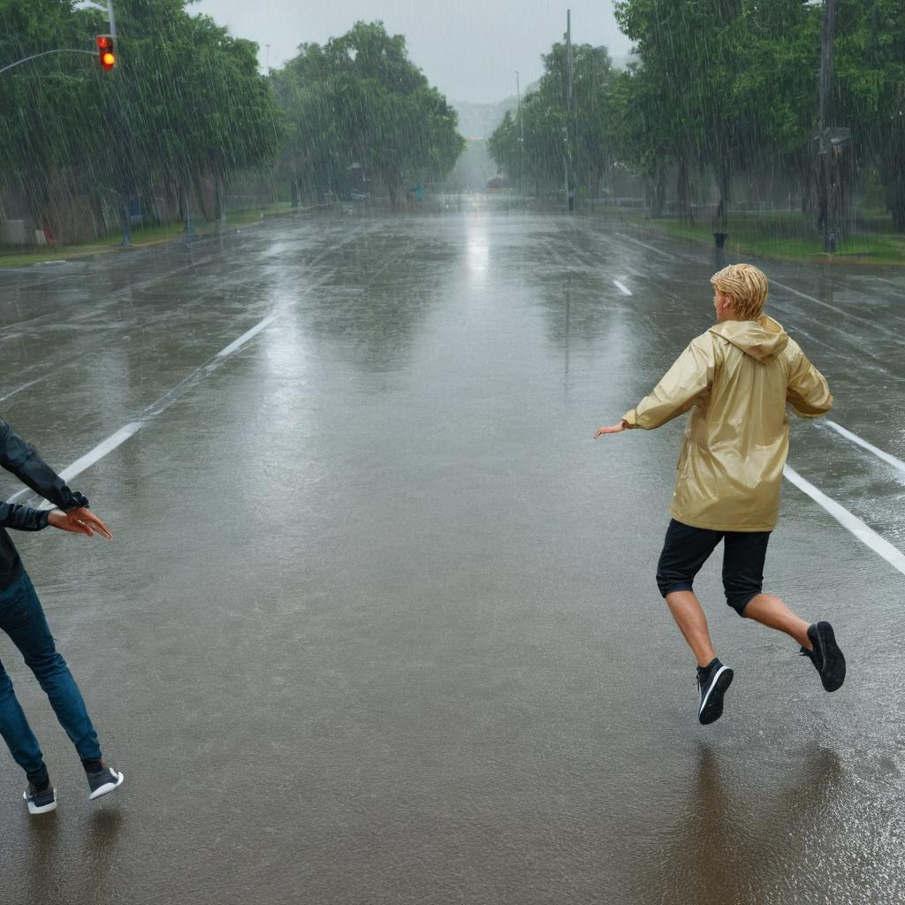
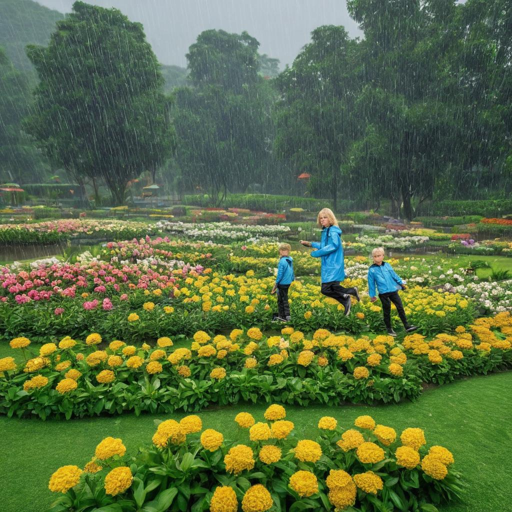

## 768✖️768
### dataset 768

  
  
  
  

### dataset 768 output

  
  
  
  

### dataset 1024

  
  
  
  

### dataset 1024 output

  
  
  
  

### dataset 1024-v2

  
  
  
  

### dataset 1024-v2 output

  
  
  
  

